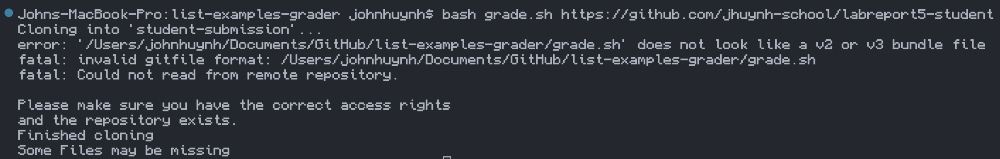

# Part 1 - Debugging Scenario
1. The original post from a student with a screenshot showing a symptom and a description of a guess at the bug/some sense of what the failure-inducing input is.

2. A response from a TA asking a leading question or suggesting a command to try.
Hi John! After reading your post about being unable to see github repo I suggest looking over the bash script once more because the repo is public and passed the test when run on my grade.sh. I suggest rewatching the lectures from week 6 to get a refresh on how to write bash scripts and see how the professor does them. He may also give insight on how such an error could occur.

3. Fixed using TA response

4. Extra Information

Extra Context:

Before the fix:

After the fix:

Terminal before the fix:

Terminal after the fix:

# Part 2 - Reflection
My lab experience in the second half was definitely better than the first half because most of the content was more applicable. The most interesting thing I learned was definitely bash scripts because it makes testing a lot easier and I also get a glimpse on how gradescope works. It is interesting because we can setup many commands all in a script to be easily run, I can see how this skill is scalable to a much larger script. One of the things I am still curious on how useful it can be is VIM, we did not touch it that much and I do not see the use in it as of yet. Compared to commands we learned such as grep and bash scripts, VIM is not seen as a useful tool to me. I am sure many people in the inductry use so I want to learn more of its use cases.
