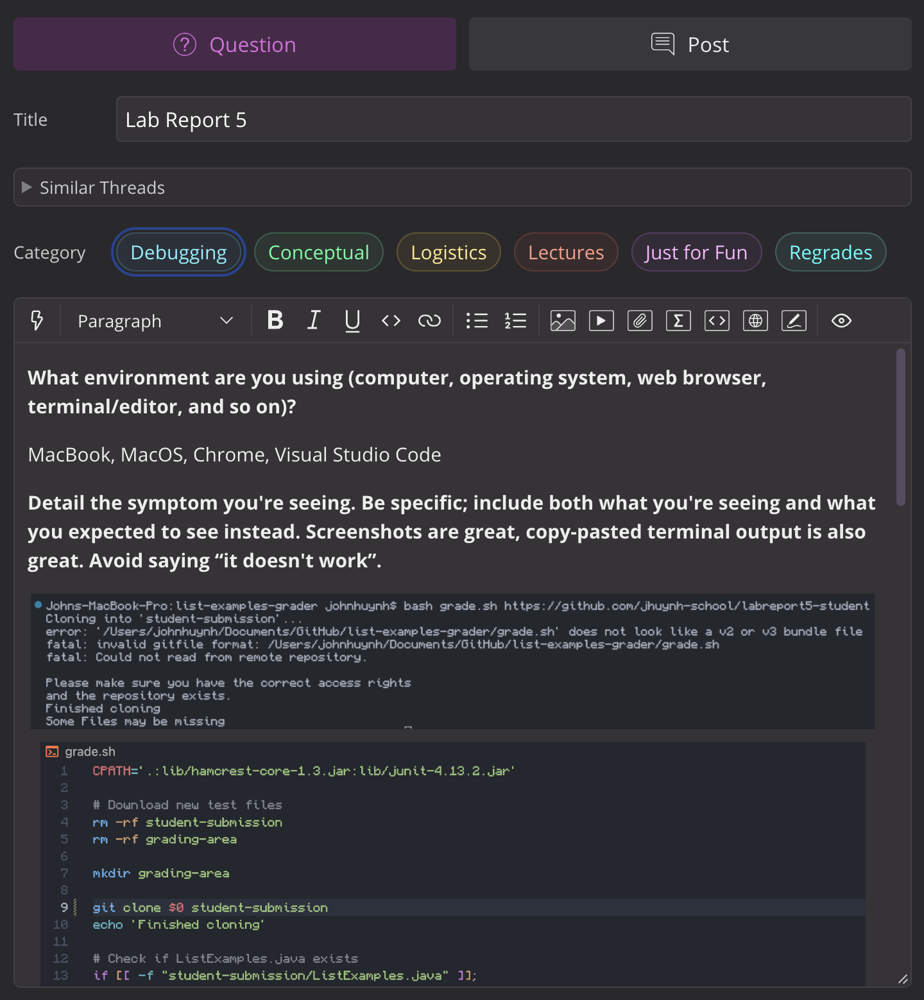
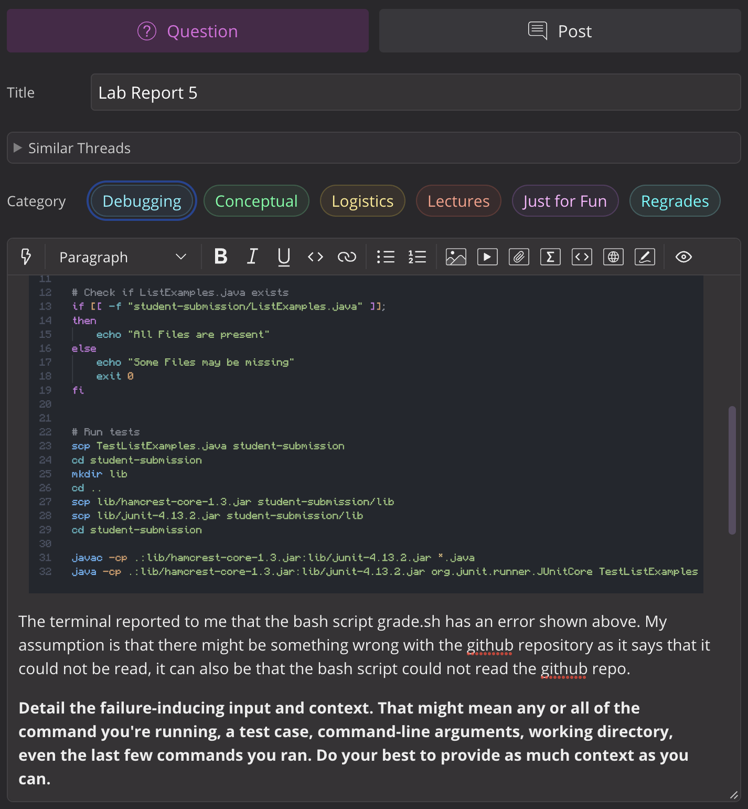
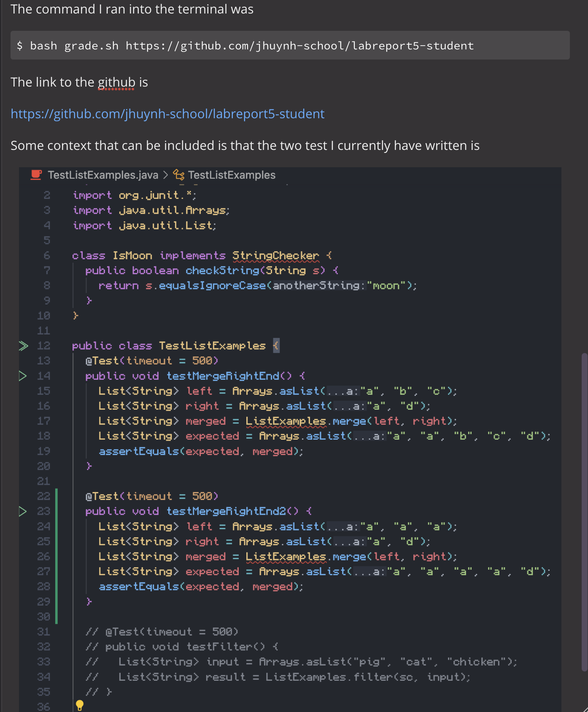
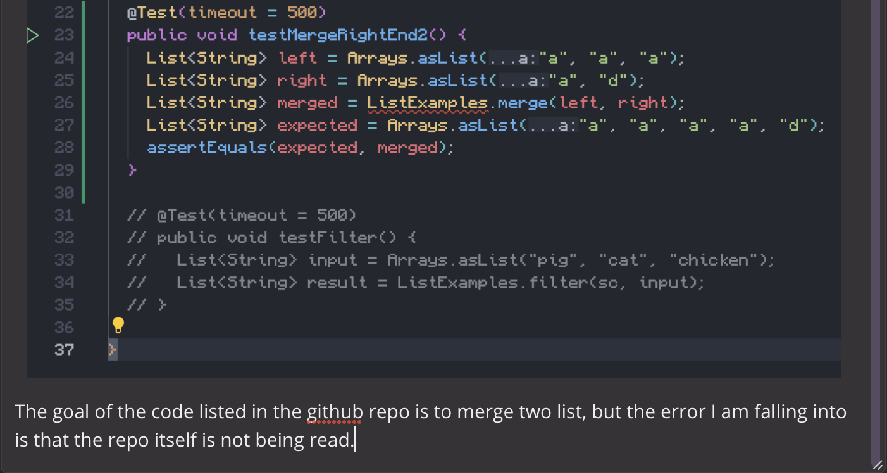
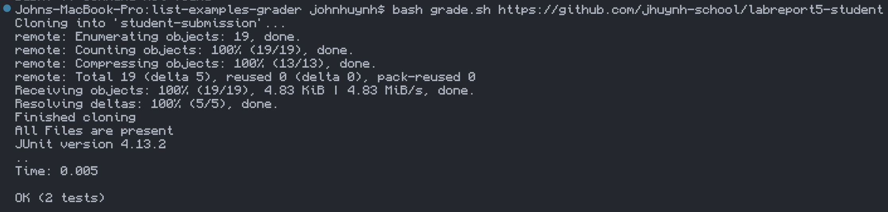
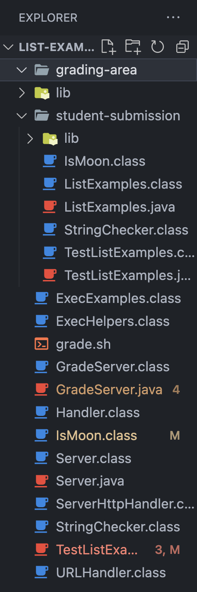
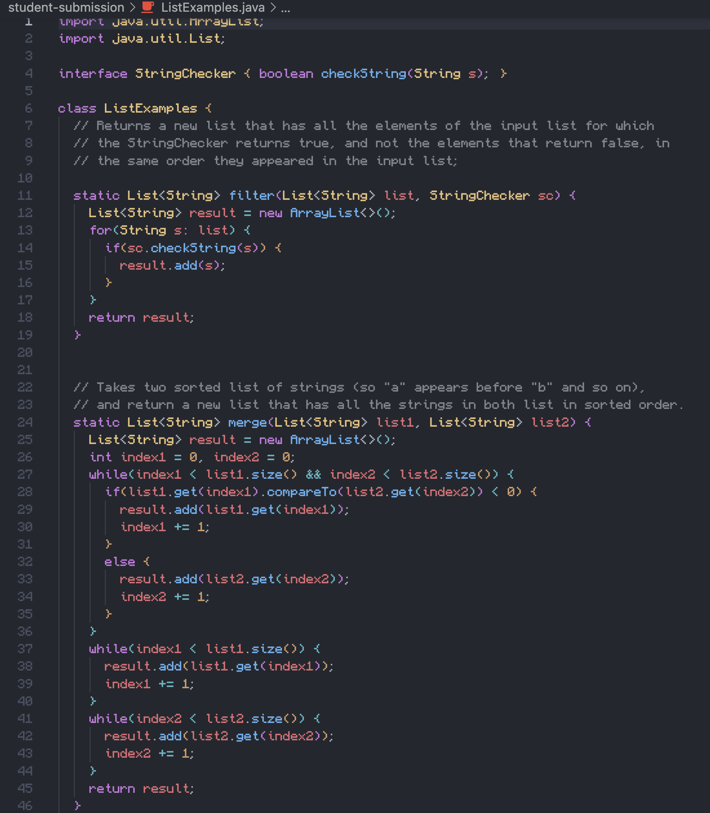
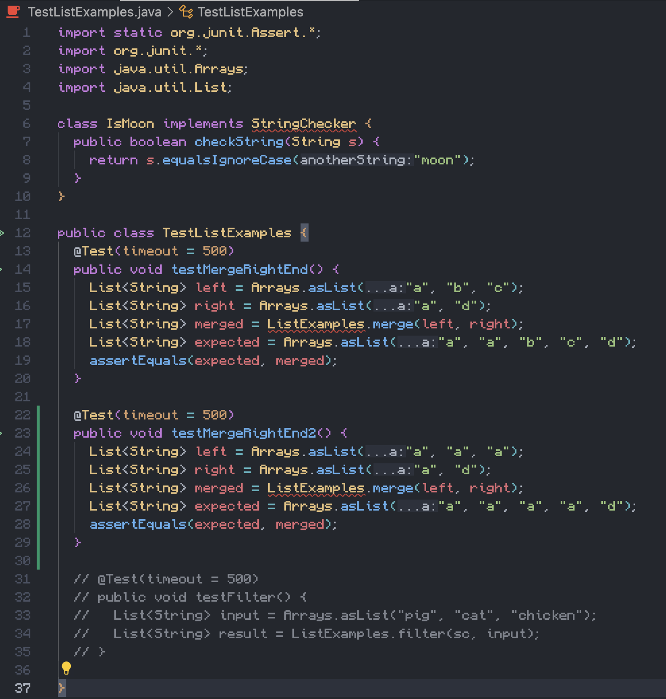
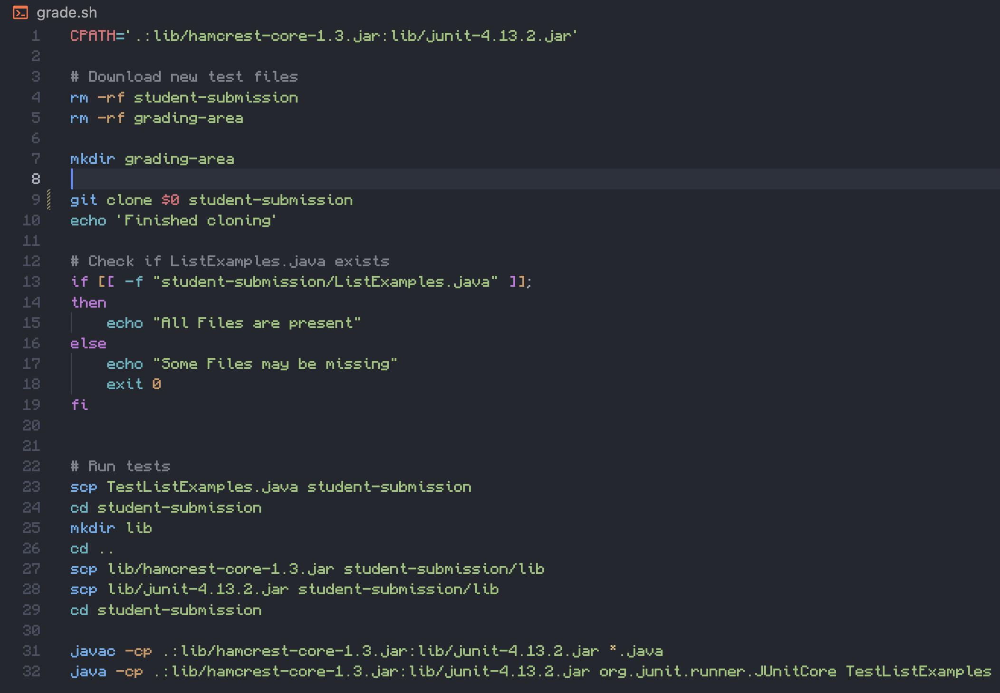

# Part 1 - Debugging Scenario
1. The original post from a student with a screenshot showing a symptom and a description of a guess at the bug/some sense of what the failure-inducing input is.

2. A response from a TA asking a leading question or suggesting a command to try.
Hi John! After reading your post about being unable to see github repo I suggest looking over the bash script once more because the repo is public and passed the test when run on my grade.sh. I suggest rewatching the lectures from week 6 to get a refresh on how to write bash scripts and see how the professor does them. He may also give insight on how such an error could occur.

3. Fixed using TA response

4. Extra Information
Extra Context:

Before the fix:

After the fix:

# Part 2 - Reflection
